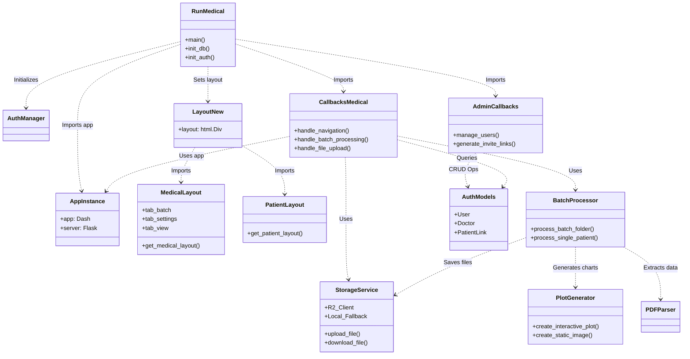

# Arhitectura Actuală a Platformei de Pulsoximetrie

Acest document vizualizează structura, relațiile și fluxul de date din cadrul aplicației, așa cum sunt definite în codul sursă curent.

## 1. Diagrama de Ansamblu (High-Level Architecture)

Această diagramă arată cum componentele majore interacționează între ele.

```mermaid
graph TD
    %% Stiluri pentru noduri
    classDef entry fill:#f9f,stroke:#333,stroke-width:2px;
    classDef core fill:#bbf,stroke:#333,stroke-width:2px;
    classDef layout fill:#bfb,stroke:#333,stroke-width:2px;
    classDef logic fill:#fbb,stroke:#333,stroke-width:2px;
    classDef data fill:#ff9,stroke:#333,stroke-width:2px;
    classDef infra fill:#ddd,stroke:#333,stroke-width:2px;

    %% Clienti
    User[Utilizator (Browser)] -->|HTTP Request| Entry
    Admin[Medic (Browser)] -->|HTTP Request| Entry

    %% Entry Points
    subgraph "Application Core"
        Entry[run_medical.py]:::entry
        AppInstance[app_instance.py]:::core
    end

    %% Relatii Core
    Entry -->|Initializează| AppInstance
    Entry -->|Folosește| Auth[Modul Autentificare]:::logic
    Entry -->|Folosește| Layouts[Layout-uri Dash]:::layout
    Entry -->|Înregistrează| Callbacks[Callbacks & Logic]:::logic

    %% Layouts
    subgraph "Frontend Layer (Dash Layouts)"
        Layouts --> MainLayout[app_layout_new.py]
        MainLayout --> DocLayout[layout_partials/medical_layout.py]
        MainLayout --> PatLayout[layout_partials/patient_layout.py]
    end

    %% Logic Layer
    subgraph "Logic & Processing Layer"
        Callbacks --> MedCB[callbacks_medical.py]
        Callbacks --> AdminCB[admin_callbacks.py]
        MedCB --> BatchProc[batch_processor.py]:::logic
        BatchProc --> PlotGen[plot_generator.py]:::logic
        BatchProc --> PDFParse[pdf_parser.py]:::logic
    end

    %% Data Layer
    subgraph "Data & Services Layer"
        Auth --> Models[auth/models.py]:::data
        BatchProc --> Storage[storage_service.py]:::data
        MedCB --> Storage
        Models --> DB[(PostgreSQL / SQLite)]:::infra
        Storage --> LocalFS[("Local FS (patient_data)")]:::infra
        Storage -.->|Opțional| R2[("Cloudflare R2")]:::infra
    end
```

## 2. Diagrama Detaliată a Fișierelor și Interfețelor

Această diagramă detaliază exact conexiunile dintre fișierele Python ("ce zic fisierele ca fac").



## 3. Legenda Structurii

*   **`run_medical.py`**: "Creierul" operațiunii. Leagă totul împreună: serverul web, baza de date, paginile (layout) și logica (callbacks).
*   **`app_instance.py`**: "Inima". Ține obiectul aplicației în viață pentru a fi accesat de oriunde fără a crea confuzie (circular imports).
*   **`layout_partials/`**: "Fața". Definește cum arată paginile (butoane, grafice, tab-uri).
    *   `medical_layout.py`: Interfața pentru doctori (complexă).
    *   `patient_layout.py`: Interfața pentru pacienți (simplă, vizualizare).
*   **`callbacks_medical.py`**: "Sistemul Nervos". Aici se întâmplă acțiunea când cineva dă click. Decide ce se procesează și ce se afișează.
*   **`storage_service.py`**: "Magazia". Se ocupă de păstrarea fișierelor. Dacă e setat, le trimite în Cloud (R2), dacă nu, le ține pe Disk (Local).
